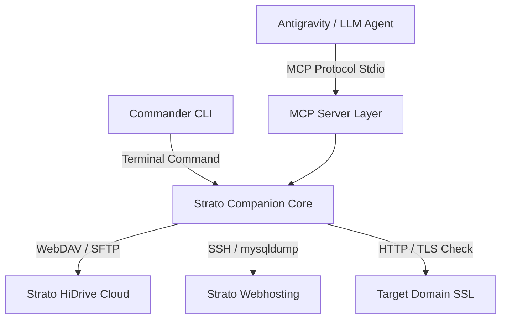

# 🚀 Strato Companion (MCP Server & CLI)

Ein intelligenter **Companion & MCP Server** zur Nahtstellen-Automatisierung von **Strato HiDrive** (Cloud-Speicher) und **Strato Webhosting** (SSH, MariaDB/MySQL).


---

## 🌟 Key Features & Capabilities

* **🩺 Health & SSL Monitoring**: Prüfe Uptime, Antwortzeiten und SSL-Zertifikate inkl. Restlaufzeit-Warnung.
* **📂 HiDrive WebDAV Integration**: Durchsuche, erstelle und lade Dateien auf deinen Strato HiDrive Cloud-Speicher hoch.
* **⚡ SSH Remote Dump**: Erstelle komprimierte MariaDB/MySQL `mysqldump` Backups direkt auf dem Webhosting per SSH und stream sie auf deinen HiDrive.
* **🤖 MCP Protocol Ready**: Integrierter Model Context Protocol Server (Stdio Transport) für LLM-Agenten (wie Antigravity).

---

## 🏗️ Architektur & Datenfluss



---

## 🛠️ Installation & Schnellstart

```bash
# 1. In das Projektverzeichnis wechseln
cd /Volumes/SSD-3/02_Projekte/01_PROJECT_COMPANION_OS/strato-companion

# 2. Abhängigkeiten installieren & bauen
npm install
npm run build

# 3. CLI Health Check ausführen
node dist/index.js health --url https://strato.de
```

---

## 📡 MCP Tools Registry

| Tool Name | Parameter | Beschreibung |
| :--- | :--- | :--- |
| `strato_hidrive_list` | `path` | Listet Dateien und Ordner auf HiDrive via WebDAV auf. |
| `strato_hidrive_get_quota` | - | Ruft Speicherauslastung und Quota des HiDrive-Kontos ab. |
| `strato_webhosting_backup_db` | `db_name` | Erstellt SSH-`mysqldump` und lädt es komprimiert auf HiDrive. |
| `strato_webhosting_exec_ssh` | `command` | Führt unkritische Shell-Befehle per SSH auf dem Hosting aus. |
| `strato_health_check` | `url` | Prüft Erreichbarkeit, Latenz und SSL-Gültigkeit einer Domain. |

---

## 🔗 Repositories & Sync-Befehle

| Host / Platform | Repository URL | Push Command |
| :--- | :--- | :--- |
| **Gitea (Self-Hosted)** | `ssh://git@192.168.2.109:2222/aom-git/strato-companion.git` | `git push origin main` |
| **GitHub** | `https://github.com/aom1941/strato-companion.git` | `git push github main` |

---

## 📄 Autor & Lizenz

MIT License • Arne O. Mueller (`admin@derarne.cloud`)
